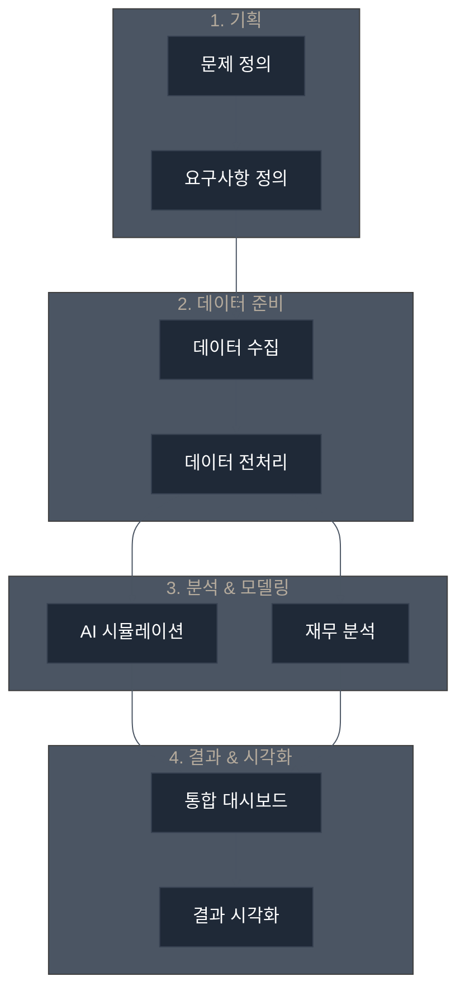
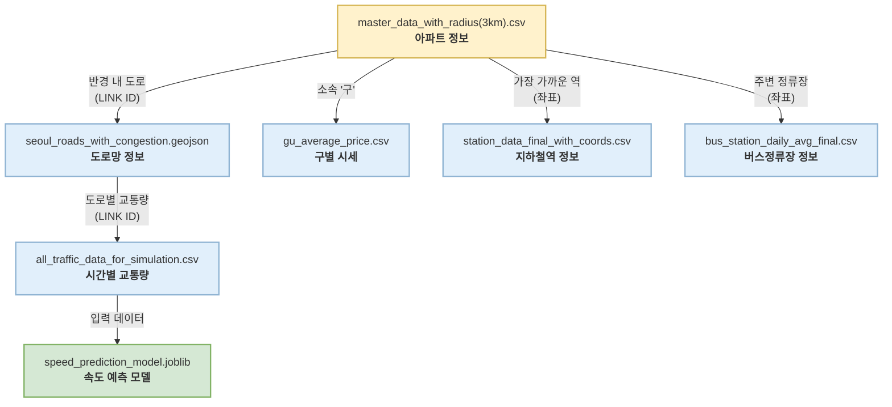

# 🏗️ SightNOVA: AI 기반 재건축 사업 타당성 분석 대시보드

HDC랩스 NOVA 1st-template 레포지토리를 기반으로 작성된 SightNOVA 프로젝트입니다.

<br>

---

## 📝 프로젝트 기획서

### 🎯 1. 프로젝트 개요

- **프로젝트 주제**: AI 기반 재건축 사업 타당성 및 인프라 영향 분석
- **목표**: 재건축 시 <b>증가되는 세대수</b>에 따른 <b>인프라 변화량(혼잡도, 교통량 등)</b>을 시뮬레이션하고, <b>기대 예상 이익(프로젝트 재무 분석)</b>을 도출하여 사업의 타당성을 종합적으로 검토하고 최적의 의사결정을 지원하는 통합 대시보드 개발.

**✨ 시각적 자료**

<small>프로젝트 기획서 다이어그램</small>

<br>

---

### 🧑‍💻 팀원 소개

| 손지원 | 김민성 | 이규경 | 이진배 | 현금비 |
|:---:|:---:|:---:|:---:|:---:|
|  |  |  |  |  |
| 팀장<br>PM<br>발표 | 참여 | 데이터 엔지니어<br>대시보드 개발 | 고문 | 데이터 찾기<br>PPT 제작 |

<br>

---

### 🗓️ 2. 프로젝트 일정 (2025-09-28 ~ 2025-10-15)

| 작업 항목 | 시작 날짜 | 종료 날짜 | 기간(일) |
| :--- | :--- | :--- | :--- |
| 1. 주제 선정 | 2025-09-30 | 2025-10-01 | 2 |
| 2. 자료 조사 및 전처리 | 2025-10-01 | 2025-10-02 | 2 |
| 3. 연휴 | 2025-10-03 | 2025-10-12 | 10 |
| 4. 대시보드 구현 | 2025-10-13 | 2025-10-14 | 2 |
| 5. PPT작성, 발표 준비 및 최종 검토 | 2025-10-14 | 2025-10-14 | 1 |
| 6. 프로젝트 발표 | 2025-10-15 | 2025-10-15 | 1 |

<br>

---

### 📊 3. 작업 분할 구조 (WBS)

1.  **기획**
    1.  문제 정의: 재건축 사업의 복잡한 의사결정 과정을 데이터 기반으로 지원할 필요성 정의
    2.  데이터 요구사항 정의: 아파트, 교통량, 도로 네트워크, 부동산 시세, 대중교통 데이터 등 필요 데이터 식별
2.  **데이터 수집 및 준비**
    1.  데이터 소스 조사: 공공데이터포털, 서울열린데이터광장 등
    2.  데이터 수집 및 저장: CSV, GeoJSON 형태로 데이터 수집 및 `data/` 폴더에 저장
    3.  데이터 전처리: `data_loader.py`를 통한 데이터 정제, 타입 통일, 파생 변수 생성
3.  **데이터 분석 및 모델링**
    1.  데이터 탐색 및 시각화: 초기 데이터 탐색
    2.  모델 선택 및 학습: 도로 속도 예측을 위한 사전 훈련된 회귀 모델(`speed_prediction_model.joblib`) 사용
    3.  성능 평가: 분석 로직 및 시뮬레이션 결과 검증
4.  **결과 도출 및 보고**
    1.  결과 요약: `analysis.py`를 통해 재무, 교통, 인프라 영향 분석 결과 도출
    2.  보고서 작성: 분석 결과를 `README.md`에 정리
    3.  최종 발표: Streamlit 대시보드를 통한 시각적 결과 보고

<br>

---

### ✅ 4. 요구사항 정의서

-   **기능 요구사항**
    -   데이터 수집 기능: `data/` 폴더의 정형/지리 데이터 로딩
    -   데이터 전처리 기능: 결측치 처리, 데이터 타입 통일, 파생 변수(출퇴근 시간대 통계 등) 생성
    -   분석 기능: 재무 분석, 교통 시뮬레이션, 대중교통 혼잡도 분석 알고리즘 적용
    -   시각화 기능: Streamlit 기반 대시보드, Folium 지도, Plotly 차트/그래프
-   **비기능 요구사항**
    -   시스템 안정성: 데이터 로딩 및 분석 중 오류 발생 최소화 (`FileNotFoundError` 처리)
    -   성능: `@st.cache_data`를 활용한 데이터 로딩 시간 최소화 및 빠른 분석 결과 제공
    -   확장성: 신규 데이터(예: 다른 지역 데이터) 추가 및 분석 모듈 확장이 용이한 구조

<br>

---

## 📐 프로젝트 설계서

### 🏛️ 1. 시스템 아키텍처

-   **구성 요소**:
    -   데이터 로딩 모듈 (`data_loader.py`)
    -   데이터 분석 모듈 (`analysis.py`)
    -   데이터 시각화 및 UI 모듈 (`app.py`, `ui_components.py`)

<br>

---

### 💾 2. 데이터 설계

-   **데이터 흐름**: 원천 데이터 (`source/`) → `scipts/.py` (전처리) → `app.py` (실행)
-   **주요 데이터 속성**:
    -   `apt_master_df`: 아파트명, 주소, 세대수, 위경도 등
    -   `hourly_congestion_df`: 도로 링크 ID, 시간대별 교통량
    -   `roads_gdf`: 도로 링크 ID, 도로명, geometry (GeoJSON)
    -   `station_df`, `bus_df`: 대중교통 정류장 정보, 승하차 인원

<br>

- **데이터 관계도**


<br>

---

### 🛠️ 3. 기술 스택

-   **Language**:
    -   `Python`: 데이터 분석, 머신러닝, 웹 개발 전반에 걸쳐 높은 생산성과 방대한 라이브러리 생태계를 제공하여 메인 언어로 채택했습니다.
-   **Data Processing & Analysis**:
    -   `pandas` & `numpy`: 테이블 형태의 데이터를 다루고 복잡한 수치 연산을 수행하기 위한 핵심 라이브러리입니다.
    -   `geopandas`: 공간 데이터를 Pandas DataFrame처럼 쉽게 다룰 수 있게 하여, 도로 및 지역 분석에 활용했습니다.
-   **AI Model & ML**:
    -   `scikit-learn` & `joblib`: 머신러닝 모델의 훈련 및 직렬화(저장/로드)를 위해 사용했습니다.
    -   `lightgbm`: 도로 속도 예측 모델의 기반이 되는 알고리즘으로, 빠르고 효율적인 성능을 제공합니다.
-   **Dashboard & Visualization**:
    -   `streamlit`: 복잡한 웹 프레임워크 없이 Python 코드만으로 빠르고 쉽게 인터랙티브 웹 대시보드를 구축하기 위해 사용했습니다.
    -   `plotly`: 동적이고 미려한 차트와 그래프를 생성하여 분석 결과를 효과적으로 시각화합니다.
    -   `folium`: `geopandas`로 처리된 공간 데이터를 지도 위에 시각화하여 직관적인 인사이트를 제공합니다.

<br>

---

### 💡 4. 예상 문제 및 해결 방안

-   **문제**: 데이터 파일 부재 또는 경로 오류
    -   **해결 방안**: `data_loader.py` 내 `try-except` 구문을 사용하여 `FileNotFoundError`를 처리하고 사용자에게 에러 메시지 표시
-   **문제**: 서로 다른 데이터 소스 간의 ID 불일치 (예: 도로 LINK ID)
    -   **해결 방안**: `data_loader.py`에서 `astype(str)`을 사용하여 주요 ID 컬럼의 데이터 타입을 문자열로 강제 통일하여 조인 오류 방지

<br>

---

## 🚀 실행 방법

1.  **필수 라이브러리 설치**:

    ```bash
    pip install -r requirements.txt
    ```

2.  **Streamlit 앱 실행**:

    ```bash
    streamlit run app.py
    ```
